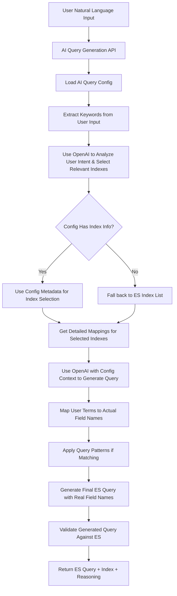

# AI-Powered Elasticsearch Query Generation API

## Overview

This document outlines the design for an AI-powered API that converts natural language queries into structured Elasticsearch queries. The API leverages OpenAI's language models to understand user intent and generate appropriate queries with intelligent index selection.

## Current System Analysis

### Existing Architecture
- **Backend**: Node.js + Express + TypeScript
- **Elasticsearch Integration**: `@elastic/elasticsearch` client
- **Security**: Rate limiting, CORS, validation middleware
- **Logging**: Winston-based structured logging
- **Current Endpoints**:
  - `GET /api/direct-query/indexes` - Get available indexes
  - `GET /api/direct-query/indexes/:indexName/mapping` - Get field mappings
  - `POST /api/direct-query` - Execute direct ES queries

### Current Dependencies
- No OpenAI integration currently exists
- No AI/ML dependencies in package.json
- Well-structured validation and error handling patterns

## Configuration-Based Approach

### Index and Field Configuration
To improve AI query generation accuracy, the system will use a configurable metadata layer that provides semantic information about indexes and fields. This configuration will include:

- **Index descriptions and tags** for better index selection
- **Field aliases and descriptions** for improved field mapping
- **Business context** to guide query generation
- **Query patterns and examples** for specific use cases

### Configuration Schema

```typescript
interface AIQueryConfig {
  version: string;
  lastUpdated: string;
  indexes: {
    [indexName: string]: IndexConfig;
  };
  globalSettings: {
    defaultQuerySize: number;
    maxQuerySize: number;
    defaultDateField: string;
    commonFilters: CommonFilter[];
  };
}

interface IndexConfig {
  name: string;
  description: string;
  tags: string[];                    // e.g., ["health", "projects", "reports"]
  category: string;                  // e.g., "health-data", "administrative", "analytics"
  priority: number;                  // 1-10, higher = more likely to be selected
  dateFields: string[];              // Primary date fields for time-based queries
  primaryFields: string[];           // Most commonly queried fields
  fields: {
    [fieldName: string]: FieldConfig;
  };
  queryPatterns: QueryPattern[];     // Common query patterns for this index
  businessContext: {
    domain: string;                  // e.g., "Healthcare", "Project Management"
    dataSource: string;              // e.g., "DHIS2", "Manual Entry"
    updateFrequency: string;         // e.g., "Daily", "Real-time"
    recordCount?: number;            // Approximate number of documents
  };
}

interface FieldConfig {
  name: string;
  type: 'text' | 'keyword' | 'date' | 'number' | 'boolean' | 'object' | 'nested';
  description: string;
  aliases: string[];                 // Alternative names for this field
  examples: string[];                // Example values
  isSearchable: boolean;             // Can be used in text searches
  isFilterable: boolean;             // Can be used in filters
  isAggregatable: boolean;           // Can be used in aggregations
  businessMeaning: string;           // What this field represents in business terms
  tags: string[];                    // e.g., ["identifier", "status", "location"]
  validValues?: string[];            // For enum-like fields
  dateFormat?: string;               // For date fields
  nestedFields?: {                   // For nested/object fields
    [subField: string]: FieldConfig;
  };
}

interface QueryPattern {
  name: string;
  description: string;
  keywords: string[];                // Keywords that trigger this pattern
  template: any;                     // Elasticsearch query template
  requiredFields: string[];          // Fields that must exist for this pattern
  examples: string[];                // Natural language examples
}

interface CommonFilter {
  name: string;
  description: string;
  field: string;
  operator: 'equals' | 'in' | 'range' | 'exists';
  values?: string[];
  isDefault: boolean;
}
```

## Proposed API Design

### New Endpoint

```
POST /api/ai-query/generate
```

### Enhanced Request Flow



### Detailed Flow Steps

1. **User Input Processing**
   - Receive natural language query
   - Extract key terms and concepts
   - Identify query intent (filter, search, aggregation, etc.)

2. **Configuration-Based Index Analysis**
   - Load AI query configuration from JSON file
   - Use OpenAI to analyze user input against config metadata
   - Score indexes based on:
     - Tag relevance to user query
     - Description similarity
     - Business context match
     - Priority weights

3. **Smart Index Selection**
   - If config has rich metadata: Use config-based scoring
   - If config is minimal: Fall back to Elasticsearch index list
   - Select top 2-3 most relevant indexes for detailed analysis

4. **Enhanced Mapping Retrieval**
   - Get Elasticsearch mappings for selected indexes
   - Enrich with configuration metadata (aliases, business meanings)
   - Filter fields based on relevance to user query

5. **AI-Powered Query Generation**
   - Send enhanced prompt to OpenAI with:
     - User query
     - Relevant index configurations
     - Field metadata with aliases
     - Matching query patterns
   - AI selects final index and generates query

6. **Field Name Translation**
   - AI uses field aliases to understand user terms
   - Maps to actual Elasticsearch field names
   - Ensures query uses correct field paths

7. **Pattern Application**
   - Check if user query matches predefined patterns
   - Apply query templates if patterns match
   - Customize templates with user-specific values

8. **Query Validation & Response**
   - Validate generated query syntax
   - Test field existence in selected index
   - Return structured response with reasoning

## Detailed API Specification

### Request Schema

```typescript
interface AIQueryGenerationRequest {
  query: string;                    // Natural language query from user
  context?: {
    preferredIndex?: string;        // Optional user preference
    dateRange?: {                   // Optional date context
      from?: string;
      to?: string;
    };
    maxResults?: number;            // Default: 50
    includeAggregations?: boolean;  // Default: false
  };
  options?: {
    explainReasoning?: boolean;     // Include AI reasoning in response
    validateQuery?: boolean;        // Pre-validate generated query (default: true)
    fallbackToSimple?: boolean;     // Fallback to simple query if complex fails
  };
}
```

### Response Schema

```typescript
interface AIQueryGenerationResponse {
  success: boolean;
  data: {
    generatedQuery: {
      index: string;                // Selected index
      query: any;                   // Generated Elasticsearch query
      from?: number;
      size?: number;
      _source?: string[] | boolean;
    };
    reasoning: {
      indexSelection: {
        selectedIndex: string;
        reason: string;
        confidence: number;         // 0-1 confidence score
        alternatives?: Array<{
          index: string;
          reason: string;
          confidence: number;
        }>;
      };
      queryGeneration: {
        queryType: string;          // "match", "bool", "range", etc.
        fieldsUsed: string[];
        reasoning: string;
        complexity: 'simple' | 'moderate' | 'complex';
      };
    };
    metadata: {
      aiModel: string;              // e.g., "gpt-4-turbo"
      processingTime: string;
      tokensUsed: {
        prompt: number;
        completion: number;
        total: number;
      };
    };
  };
  error?: {
    code: string;
    message: string;
    details?: any;
  };
  meta: {
    operationId: string;
    totalTime: string;
    timestamp: string;
  };
}
```

## Implementation Architecture

### 1. Configuration Service

```typescript
// services/configService.ts
class ConfigService {
  private config: AIQueryConfig | null = null;
  private configPath: string = './config/ai-query-config.json';
  
  async loadConfig(): Promise<AIQueryConfig>
  getIndexConfig(indexName: string): IndexConfig | null
  getFieldConfig(indexName: string, fieldName: string): FieldConfig | null
  findIndexesByTags(tags: string[]): IndexConfig[]
  findFieldsByAlias(alias: string): Array<{index: string, field: string}>
  getQueryPatterns(indexName: string, keywords: string[]): QueryPattern[]
  private validateConfig(): boolean
}
```

### 2. Enhanced Service Layer

```typescript
// services/aiQueryGeneration.ts
class AIQueryGenerationService {
  constructor(
    private configService: ConfigService,
    private elasticsearchService: ElasticsearchService
  ) {}
  
  async generateQuery(request: AIQueryGenerationRequest): Promise<AIQueryGenerationResponse> {
    // Step 1: Extract keywords and analyze user intent
    const keywords = this.extractKeywords(request.query);
    
    // Step 2: Use AI to select relevant indexes based on config
    const relevantIndexes = await this.selectIndexesWithAI(request.query, keywords);
    
    // Step 3: Get detailed mappings for selected indexes
    const enhancedIndexInfo = await this.getEnhancedIndexInfo(relevantIndexes);
    
    // Step 4: Find matching query patterns
    const relevantPatterns = this.findRelevantPatterns(relevantIndexes, keywords);
    
    // Step 5: Generate query using AI with full context
    const aiResponse = await this.generateQueryWithAI(
      request.query, 
      enhancedIndexInfo, 
      relevantPatterns
    );
    
    // Step 6: Validate and return response
    await this.validateGeneratedQuery(aiResponse.query, aiResponse.selectedIndex);
    
    return this.buildResponse(aiResponse, request);
  }
  
  private extractKeywords(userQuery: string): string[] {
    // Extract meaningful terms from user query
    // Remove stop words, extract entities, etc.
  }
  
  private async selectIndexesWithAI(userQuery: string, keywords: string[]): Promise<IndexConfig[]> {
    // Use OpenAI to analyze user intent and match against index configs
    // Return top 2-3 most relevant indexes
  }
  
  private async getEnhancedIndexInfo(indexes: IndexConfig[]): Promise<EnhancedIndexInfo[]> {
    // Combine config metadata with Elasticsearch mappings
    // Enrich field information with aliases and business meanings
  }
  
  private findRelevantPatterns(indexes: IndexConfig[], keywords: string[]): QueryPattern[] {
    // Find query patterns that match user keywords
    // Return applicable templates
  }
  
  private async generateQueryWithAI(
    userQuery: string,
    indexInfo: EnhancedIndexInfo[],
    patterns: QueryPattern[]
  ): Promise<AIGenerationResult> {
    // Build comprehensive prompt with all context
    // Call OpenAI API
    // Parse and validate response
  }
  
  private async validateGeneratedQuery(query: any, index: string): Promise<boolean> {
    // Validate query syntax
    // Check field existence in index
    // Ensure query is safe to execute
  }
  
  private buildEnhancedPrompt(
    userQuery: string, 
    indexConfigs: EnhancedIndexInfo[], 
    relevantPatterns: QueryPattern[]
  ): string {
    // Build the sophisticated prompt using configuration metadata
  }
}

interface EnhancedIndexInfo {
  config: IndexConfig;
  mapping: any;
  relevantFields: FieldConfig[];
  score: number;
}

interface AIGenerationResult {
  selectedIndex: string;
  query: any;
  confidence: number;
  reasoning: {
    indexSelection: any;
    fieldMapping: any[];
    queryStrategy: string;
    appliedPatterns: string[];
  };
}
```

### 3. Controller Implementation

```typescript
// controllers/aiQueryController.ts
class AIQueryController {
  constructor(private aiQueryService: AIQueryGenerationService) {}
  
  async generateQuery(req: Request, res: Response): Promise<void>
  private validateRequest(req: Request): AIQueryGenerationRequest | ValidationError[]
  private handleOpenAIError(error: any): APIError
}
```

### 4. New Dependencies Required

```json
{
  "dependencies": {
    "openai": "^4.20.0",           // OpenAI API client
    "zod": "^3.22.0",              // Schema validation
    "tiktoken": "^1.0.0"           // Token counting
  }
}
```

### 5. Configuration File Structure

The configuration will be stored as a simple JSON file in the `server/config/` directory:

```
server/
├── config/
│   └── ai-query-config.json       // Main configuration file
├── src/
│   ├── services/
│   │   ├── configService.ts        // Service to read config
│   │   └── aiQueryGeneration.ts
│   └── controllers/
│       └── aiQueryController.ts
```

## Enhanced OpenAI Integration Strategy

### Configuration-Enhanced Prompt Engineering

The system will use a sophisticated prompt structure leveraging configuration metadata:

```
ROLE: You are an Elasticsearch query expert that converts natural language to ES queries using provided metadata.

CONTEXT:
User Query: "{userQuery}"

AVAILABLE INDEXES:
{indexConfigs.map(config => `
Index: ${config.name}
Description: ${config.description}
Domain: ${config.businessContext.domain}
Tags: ${config.tags.join(', ')}
Priority: ${config.priority}
Key Fields: ${config.primaryFields.join(', ')}
Date Fields: ${config.dateFields.join(', ')}
`).join('\n')}

FIELD DETAILS FOR RELEVANT INDEXES:
{selectedIndexes.map(index => 
  Object.entries(index.fields).map(([fieldName, fieldConfig]) => `
  ${index.name}.${fieldName}:
    - Type: ${fieldConfig.type}
    - Description: ${fieldConfig.description}
    - Business Meaning: ${fieldConfig.businessMeaning}
    - Aliases: ${fieldConfig.aliases.join(', ')}
    - Examples: ${fieldConfig.examples.join(', ')}
    - Tags: ${fieldConfig.tags.join(', ')}
    ${fieldConfig.validValues ? `- Valid Values: ${fieldConfig.validValues.join(', ')}` : ''}
  `).join('\n')
).join('\n')}

QUERY PATTERNS:
{relevantPatterns.map(pattern => `
Pattern: ${pattern.name}
Description: ${pattern.description}
Keywords: ${pattern.keywords.join(', ')}
Example Queries: ${pattern.examples.join('; ')}
Required Fields: ${pattern.requiredFields.join(', ')}
`).join('\n')}

TASK:
1. Analyze the user query for key concepts and intent
2. Select the most appropriate index based on tags, description, and business context
3. Map user terms to field aliases and business meanings
4. Apply relevant query patterns if they match the user intent
5. Generate a valid Elasticsearch query using actual field names (not aliases)
6. Provide detailed reasoning for your choices

CONSTRAINTS:
- ONLY use field names that exist in the selected index (not aliases)
- Consider field business meanings when mapping user concepts
- Use query patterns when they match the user intent
- Respect field constraints (validValues, types, etc.)
- Prefer indexes with higher priority when relevance is equal
- Generate syntactically correct ES queries
- Handle date fields using the specified dateFormat

OUTPUT FORMAT:
{
  "selectedIndex": "index-name",
  "confidence": 0.85,
  "query": { /* ES query object using actual field names */ },
  "reasoning": {
    "indexSelection": {
      "primary": "main reason for index selection",
      "factors": ["factor1", "factor2", "factor3"],
      "matchedTags": ["tag1", "tag2"],
      "businessContext": "how business domain influenced selection"
    },
    "fieldMapping": [
      {
        "userTerm": "status",
        "mappedField": "Data.status",
        "reason": "matched alias and business meaning",
        "fieldDescription": "Project execution status"
      }
    ],
    "queryStrategy": "explanation of query approach and patterns used",
    "appliedPatterns": ["pattern-name-1"]
  }
}
```

### Token Management

- **Input token estimation**: Use tiktoken for accurate counting
- **Response optimization**: Structured JSON responses to minimize tokens
- **Caching strategy**: Cache frequently used index mappings
- **Rate limiting**: Enhanced rate limiting for AI endpoints

## Security Considerations

### API Security
- **Enhanced rate limiting**: Lower limits for AI endpoints (e.g., 10 requests/minute)
- **Input validation**: Strict validation of natural language input (max length, content filtering)
- **Query validation**: Validate all generated queries before returning
- **OpenAI key security**: Environment variable with proper rotation strategy

### Data Privacy
- **No sensitive data in prompts**: Only send index names and field mappings to OpenAI
- **Audit logging**: Log all AI interactions for monitoring
- **Response sanitization**: Ensure AI responses don't contain unexpected content

## Error Handling Strategy

### Error Categories

1. **Validation Errors** (400)
   - Missing or invalid input
   - Query too long/complex

2. **OpenAI API Errors** (502/503)
   - API rate limits exceeded
   - Model unavailable
   - Invalid API key

3. **Query Generation Errors** (422)
   - Unable to map query to available indexes
   - Generated query validation failed

4. **Internal Errors** (500)
   - Elasticsearch connection issues
   - Service unavailable

### Fallback Strategies

1. **Simple Query Fallback**: If complex query generation fails, fall back to basic text search
2. **Manual Index Selection**: If AI can't select index, prompt user for selection
3. **Query Suggestion**: If generation fails, provide query suggestions/templates

## Performance Considerations

### Configuration-Based Optimizations
- **Smart index pre-filtering**: Use tags and keywords to limit indexes sent to AI
- **Field relevance ranking**: Only include highly relevant fields in prompts
- **Pattern matching optimization**: Cache and reuse query patterns
- **Config-based caching**: Cache configuration parsing and field lookups

### Caching Strategy
- **Configuration caching**: Cache parsed config in memory (reload on server restart)
- **Index metadata caching**: Cache enhanced index information (TTL: 1 hour)
- **Pattern matching cache**: Cache keyword-to-pattern mappings
- **OpenAI response caching**: Cache similar natural language queries (TTL: 24 hours)
- **Field alias cache**: Cache alias-to-field mappings for fast lookups

### Optimization
- **Intelligent prompt building**: Only include relevant indexes and fields
- **Parallel processing**: Load config and analyze query concurrently
- **Token optimization**: Minimize prompt size using config-based filtering
- **Response streaming**: Stream responses for better perceived performance

## Monitoring and Analytics

### Metrics to Track
- **Query success rate**: Percentage of successful AI query generations
- **Index selection accuracy**: Manual feedback system for index selection quality
- **Query execution success**: Track if generated queries execute successfully
- **Response time**: Track AI processing time vs. total response time
- **Token usage**: Monitor OpenAI token consumption and costs

### Logging Strategy
- **Structured logging**: JSON format with operation IDs
- **AI interaction logs**: Log all OpenAI requests/responses (sanitized)
- **Performance logs**: Track timing for each stage of processing
- **Error categorization**: Detailed error logging for debugging

## Future Enhancements

### Phase 2 Features
1. **Query optimization**: AI-powered query performance optimization
2. **Result explanation**: AI explanation of query results
3. **Learning system**: Improve suggestions based on user feedback
4. **Multi-index queries**: AI generation of complex multi-index joins

### Advanced Features
1. **Visual query building**: Convert natural language to visual query builder
2. **Query history analysis**: AI analysis of user query patterns
3. **Automated reporting**: AI-generated insights from query results
4. **Natural language result summaries**: AI summaries of query results

## Cost Estimation

### OpenAI API Costs (GPT-4-turbo)
- **Input tokens**: ~500-1000 tokens per request (index info + user query)
- **Output tokens**: ~200-500 tokens per response
- **Estimated cost**: $0.01-0.02 per query generation
- **Monthly estimate**: For 1000 queries/month = $10-20

### Development Effort
- **Initial implementation**: 2-3 weeks
- **Testing and refinement**: 1-2 weeks
- **Documentation and deployment**: 1 week
- **Total**: 4-6 weeks

## Testing Strategy

### Unit Tests
- Input validation
- Prompt generation
- Response parsing
- Error handling

### Integration Tests
- OpenAI API integration
- Elasticsearch query validation
- End-to-end query generation flow

### Manual Testing
- Natural language query variations
- Index selection accuracy
- Query complexity handling
- Error scenario testing

## Deployment Considerations

### Environment Variables
```bash
OPENAI_API_KEY=your-openai-key
OPENAI_MODEL=gpt-4-turbo
OPENAI_MAX_TOKENS=1500
OPENAI_TEMPERATURE=0.1
AI_QUERY_RATE_LIMIT=10  # requests per minute
AI_QUERY_CACHE_TTL=86400  # 24 hours
```

### Infrastructure
- **API key rotation**: Implement secure key rotation strategy
- **Load balancing**: Handle OpenAI API rate limits across multiple keys if needed
- **Monitoring**: Set up alerts for API failures and cost thresholds

This design provides a comprehensive foundation for implementing AI-powered Elasticsearch query generation while maintaining the existing system's security, performance, and architectural patterns.